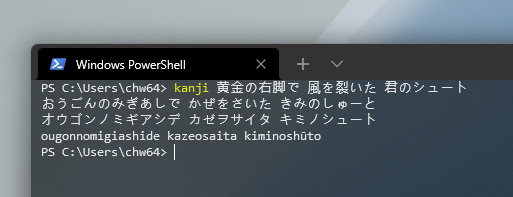

# CLI Kanji

Transform Japanese kanji into Hiragana / Katakana / Romaji.

## Quick start

 - `git clone`
 - Build project via Visual Studio / Rider / .NET CLI.
 - Do anything you want with `CLIKanji.exe` under `bin`.
